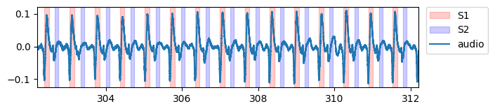
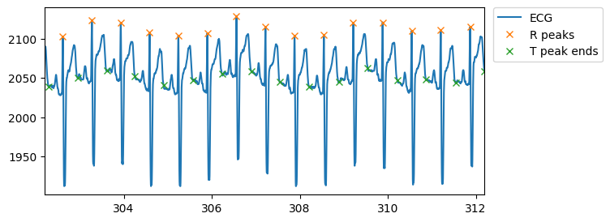

**HeartSounds** is a package for automatically annotating heart sounds locations based on ECG traces.





# Quick example

```python
from src.find_ecg_peaks import find_ecg_peaks
from src.annotations import get_heart_sound_timings_by_intervals, save_annotations_to_file
import wfdb

# Download example data
signal, fields = wfdb.rdsamp('ECGPCG0007', pn_dir='ephnogram/WFDB', channels=[0])
ecg = signal[:, 0]
ecg_sample_rate = fields['fs']

# Find ECG R and T peaks
ecg_peaks = find_ecg_peaks(ecg, ecg_sample_rate)

# Find heart sound timings
annotations = get_heart_sound_timings_by_intervals(ecg_peaks)

# Save annotations to file
save_annotations_to_file('./', 'annotations', annotations)
```

# Examples

- [Heart sounds annotations](example-produce-heart-sound-annotations.ipynb)
- [Using local ECG files](example-local-file.ipynb)
- [Using multiple ECG files](example-multiple-files.ipynb)
- [Visualizations using ECG and PCG](example-visualizations.ipynb)
- [Visualizations using local ECG and PCG files](example-visualizations-local-file.ipynb)